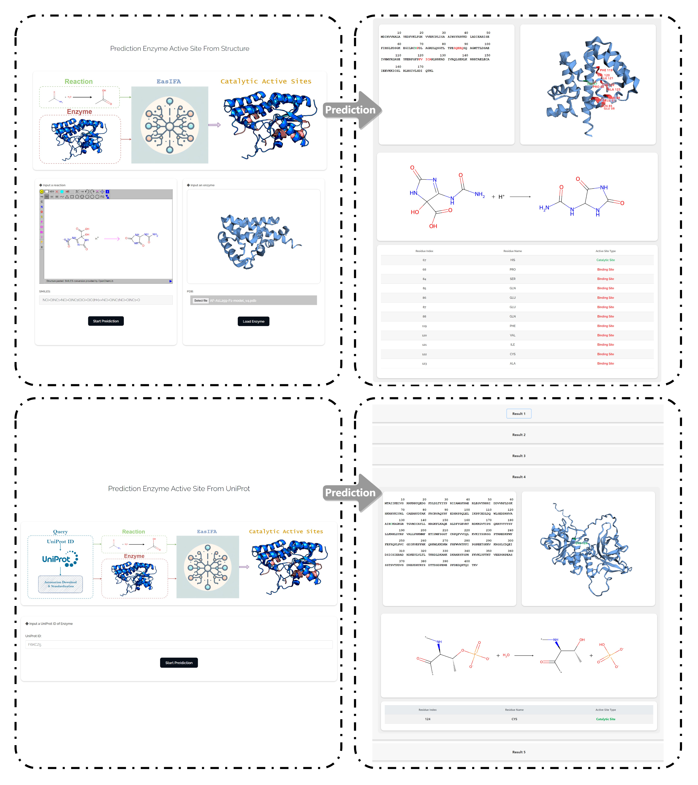

# EasIFA

<div id="top" align="center">

  <h3>Multi-Modal Deep Learning Enables Ultrafast and Accurate Annotation of Enzymatic Active Sites</h3>
  
  [](https://github.com/wangxr0526/EasIFA/stargazers)
  [](http://easifa.iddd.group/)
  
  [](https://zenodo.org/doi/10.5281/zenodo.12819439)

</div>


## Contents

- [Publication](#publication)
- [Web Server](#web-server)
- [Quickly Start From Gitpod](#quickly-start-from-gitpod)
- [OS Requirements](#os-requirements)
- [Python Dependencies](#python-dependencies)
- [Installation Guide](#installation-guide)
- [Reproduce Results](#reproduce-results)
    - [Scoring Directly from the Downloaded Results Files](#1-scoring-directly-from-the-downloaded-results-files)
    - [Download Checkpoints and Dataset](#2-download-checkpoints-and-dataset)
    - [Test EasIFA](#3-test-easifa)

- [Cite Us](#cite-us)

## Publication
[Multi-Modal Deep Learning Enables Ultrafast and Accurate Annotation of Enzymatic Active Sites](https://doi.org/10.1038/s41467-024-51511-6)

## Web Server

We have developed a [WebServer](http://cadd.zju.edu.cn/easifa/) for EasIFA, which allows you to conveniently annotate the active sites of enzymes you are interested in. The workflow is divided into two logical steps: [1)](http://cadd.zju.edu.cn/easifa/from_structure) You can directly upload the PDB structure of the enzyme and the catalyzed reaction equation, [2)](http://cadd.zju.edu.cn/easifa/from_uniprot) Provide the UniProt ID of the enzyme of interest directly.<br>



## Quickly Start From Gitpod
About 15 minutes for automated deployment. <br>
[](https://gitpod.io/github.com/wangxr0526/EasIFA) 


## OS Requirements
This repository has been tested on **Linux**  operating systems.

## Python Dependencies
* Python (version >= 3.8) 
* PyTorch (version >= 1.12.1) 
* RDKit (version >= 2019)
* TorchDrug (version == 0.2.1)
* fair-esm (version == 2.0.1)
* Py3Dmol (version ==2.0.3)

## Installation Guide
Create a virtual environment to run the code of EasIFA.<br>
It is recommended to use conda to manage the virtual environment.The installation method for conda can be found [here](https://conda.io/projects/conda/en/stable/user-guide/install/linux.html#installing-on-linux).<br>
Make sure to install pytorch with the cuda version that fits your device.<br>
This process usually takes few munites to complete.<br>
```
git clone https://github.com/wangxr0526/EasIFA.git
cd EasIFA
chmod +x ./setup_EasIFA.sh
./setup_EasIFA.sh
conda activate easifa_env
```


## Reproduce Results
### **[1]** Scoring Directly from the Downloaded Results Files
Open the Jupyter notebook file [`script/scoring_results.ipynb`](script/scoring_results.ipynb), follow the links within to download the result files and place them in the corresponding paths. Run the cells sequentially to obtain the results reported in the paper.

### **[2]** Download Checkpoints and Dataset

Running the following command can download the model's checkpoints and datasets (including the PDB structures in the dataset).

```
python download_data.py
```
The links correspond to the paths of the zip files as follows:
```
https://drive.google.com/uc?id=1ra11M4PpIalKx9ZZP-mrgj13IuFakjz3    --->    checkpoints.zip  (14Gb)
https://drive.google.com/uc?id=15c-KoZ47TpF9_qyQfJiY67gcgVZ8N5WR    --->    dataset.zip      
```

### **[3]** Test EasIFA
Test in the SwissProt E-RXN ASA dataset:

Active site position prediction task:

EasIFA-ESM-bin:
```
python main_test.py --gpu CUDA_ID \
                    --task_type active-site-position-prediction \
                    --dataset_path dataset/ec_site_dataset/uniprot_ecreact_cluster_split_merge_dataset_limit_100 \
                    --checkpoint checkpoints/enzyme_site_predition_model/train_in_uniprot_ecreact_cluster_split_merge_dataset_limit_100_at_2024-05-24-02-53-35/global_step_92000
```
EasIFA-SaProt-bin:

```
python main_test_saprot.py --gpu CUDA_ID \
                    --task_type active-site-position-prediction \
                    --dataset_path dataset/ec_site_dataset/uniprot_ecreact_cluster_split_merge_dataset_limit_100 \
                    --checkpoint checkpoints/enzyme_site_prediction_saprod_embding_model/train_in_uniprot_ecreact_cluster_split_merge_dataset_limit_100_at_2024-05-16-10-25-16/global_step_14000
```
EasIFA-NG-bin:
```
python main_test.py --gpu CUDA_ID \
                    --task_type ablation-experiment-3 \
                    --dataset_path dataset/ec_site_dataset/uniprot_ecreact_cluster_split_merge_dataset_limit_100 \
                    --checkpoint checkpoints/enzyme_site_no_gearnet_prediction_model/train_in_uniprot_ecreact_cluster_split_merge_dataset_limit_100_at_2024-05-20-05-13-33/global_step_24000
```

Active site categorie prediction task

EasIFA-ESM-multi:
```
python main_test.py --gpu CUDA_ID \
                    --task_type active-site-categorie-prediction \
                    --dataset_path dataset/ec_site_dataset/uniprot_ecreact_cluster_split_merge_dataset_limit_100 \
                    --checkpoint checkpoints/enzyme_site_type_predition_model/train_in_uniprot_ecreact_cluster_split_merge_dataset_limit_100_at_2024-05-26-02-48-38/global_step_86000
```
EasIFA-SaProt-multi:
```
python main_test_saprot.py --gpu CUDA_ID \
                    --task_type active-site-categorie-prediction \
                    --dataset_path dataset/ec_site_dataset/uniprot_ecreact_cluster_split_merge_dataset_limit_100 \
                    --checkpoint checkpoints/enzyme_site_type_prediction_saprod_embding_model/train_in_uniprot_ecreact_cluster_split_merge_dataset_limit_100_at_2024-05-19-20-00-00/global_step_72000
```
Test in the MCSA E-RXN CSA dataset:

EasIFA-ESM-bin
```
python test_knowledge_transfer_learning.py --gpu CUDA_ID \
                                            --dataset_path dataset/mcsa_fine_tune/normal_mcsa \
                                            --structure_path dataset/mcsa_fine_tune/structures \
                                            --checkpoint checkpoints/enzyme_site_predition_model_finetune_with_mcsa/train_in_normal_mcsa_at_2023-10-06-09-48-04/global_step_37200
```
EasIFA-SaProt-bin
```
python test_knowledge_transfer_learning.py --gpu CUDA_ID \
                                            --dataset_path dataset/mcsa_fine_tune/normal_mcsa \
                                            --structure_path dataset/mcsa_fine_tune/structures \
                                            --checkpoint checkpoints/enzyme_site_predition_saprot_embding_model_finetune_with_mcsa/train_in_normal_mcsa_at_2024-05-23-08-05-31/global_step_19400 \
                                            --use_saprot
```
## Cite Us

```bibtex
@article{wang_easifa_2024,
	title = {Multi-modal deep learning enables efficient and accurate annotation of enzymatic active sites},
	volume = {15},
	issn = {2041-1723},
	url = {https://www.nature.com/articles/s41467-024-51511-6},
	doi = {10.1038/s41467-024-51511-6},
	urldate = {2024-08-27},
	journal = {Nature Communications},
	author = {Wang, Xiaorui and Yin, Xiaodan and Jiang, Dejun and Zhao, Huifeng and Wu, Zhenxing and Zhang, Odin and Wang, Jike and Li, Yuquan and Deng, Yafeng and Liu, Huanxiang and Luo, Pei and Han, Yuqiang and Hou, Tingjun and Yao, Xiaojun and Hsieh, Chang-Yu},
	month = aug,
	year = {2024},
	pages = {7348},
}
```
